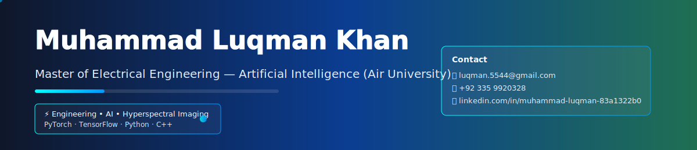

<!-- README.md for Muhammad Luqman Khan - CV -->

<!-- Show the animated banner (SVG) -->

  

# Muhammad Luqman Khan

**Master of Electrical Engineering (Artificial Intelligence)** — Air University  
_National Defence University, Islamabad_ · 📧 luqman.5544@gmail.com · 📞 +92 335 9920328  
[LinkedIn](https://www.linkedin.com/in/muhammad-luqman-83a1322b0/)

---

## Education

**Master of Electrical Engineering (Specialized in Artificial Intelligence)** — *Air University*  
**CPGA:** 3.86 / 4.00 · *Coursework completed, thesis in progress*  
- Research on AI algorithms, optimization models, linear systems, wireless sensor networks.  
- Developed machine-learning model for brain tumor classification using hyperspectral imagery.

**Bachelor of Electrical Engineering (Electronics)** — *NUST (National University of Sciences and Technology), Rawalpindi* — 2016  
**CPGA:** 2.65 / 4.00  
- Major subjects: Electronic Networks, Circuits, Electromagnetics, Data Structures.  
- Project work: power supply for giraffe Radar, circuit design and mechanical system analysis.

---

## Skills

- **Programming:** Python, C++ — experience with TensorFlow & PyTorch for hyperspectral image analysis  
- **Web:** WordPress / WooCommerce site design  
- **Mobile:** Android app (PDF reader) — Java, Android Studio  
- **Design & Media:** Adobe Photoshop, Illustrator, Premiere, After Effects  
- **Video Editing:** Premiere Pro, After Effects, Filmora, ProShow  
- **Documentation:** Word & Excel financial/administrative documents  
- **Communication:** Strong written & verbal communication skills

---

## Professional Experience

**National Defence University (NDU)** — Managerial Appointments  
- Led financial documentation processes and compliance.  
- Streamlined cross-functional administrative workflows.  
- Managed international seminars, workshops, and round-table events in collaboration with Institute of Strategic Studies Research & Analysis — topics included Climate Change, Cultural Heritage Revival, Media & Soft Power.

---

## Hobbies & Interests

- Graphic design, logo creation  
- Photography & drone usage  
- Indoor sports: Chess, table tennis  
- Outdoor sports: Badminton, football

---

## Download / Contact

- Email: luqman.5544@gmail.com  
- LinkedIn: https://www.linkedin.com/in/muhammad-luqman-83a1322b0/

---

*This README is optimized for GitHub. The `banner.svg` file uses SVG animation (no scripts) so it will animate when the README is viewed on GitHub.*
